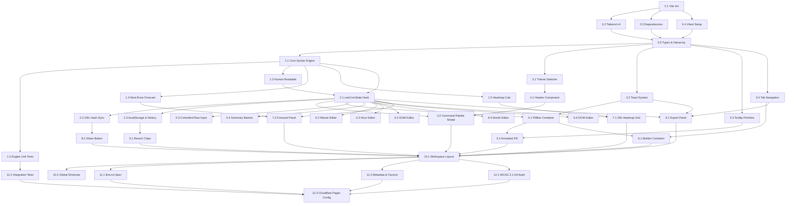

# CronBuild.com — Implementation Plan (Production-Grade)

> Derived from [CronBuild_BRD_v1.0.md](./CronBuild_BRD_v1.0.md)
>
> **Stack:** React 19+ (Vite 6), TypeScript 5.7+ (Strict), Tailwind CSS v4, Lucide Icons
> **Libraries:** `cronstrue`, `cron-parser`
> **Testing:** Vitest, React Testing Library, jsdom
> **Hosting:** Cloudflare Pages (100% Client-Side Static SPA, Zero Backend, Privacy-First)

---

## Architecture Overview & Quality Principles

1. **Modern Developer-Tool Aesthetics:** Dark-mode first by default (deep `zinc-950` / `zinc-900` surfaces, subtle `zinc-800` borders, luminous `emerald-500` / `cyan-400` accents, Geist / Inter typography, JetBrains Mono for expressions).
2. **Bi-Directional State Integrity:** Separation of the active typed raw input draft buffer from the validated `CronState` AST. Guarantees zero cursor jumps, zero focus loss, and immediate reactive updates across all components.
3. **Automated Test Guardrails:** Every core parsing, formatting, validation, and serialization function must have 100% test coverage using Vitest before UI integration.
4. **Rich Micro-Interactions:** CSS-only animations (smooth token flip/fade transitions, change-diff pulse glows, toast notification queues, accessible hover tooltips).
5. **Keyboard & Accessibility First (WCAG 2.1 AA):** `Cmd+K` / `Ctrl+K` command palette, arrow-key grid navigation, semantic ARIA landmarks, live-region screen reader announcements.

---

## Phase 0 — Project Scaffolding & Engineering Tooling

### Task 0.1: Initialize Vite 6 + React 19 + TypeScript (Strict)

**Scope:**
- Initialize a React + TypeScript project at the repository root using Vite (`npm create vite@latest . -- --template react-ts`).
- Configure `tsconfig.json` and `tsconfig.app.json`:
  - Enable `strict: true`, `noUncheckedIndexedAccess: true`, `exactOptionalPropertyTypes: true`.
  - Configure path alias: `@/*` → `./src/*`.
- Configure `vite.config.ts` with `vite-tsconfig-paths` (or `@` alias resolution) and optimize dependencies.
- Verify `npm run dev` serves cleanly on `http://localhost:5173`.

**Files to create/modify:** `package.json`, `tsconfig.json`, `tsconfig.app.json`, `vite.config.ts`, `src/main.tsx`, `src/App.tsx`, `index.html`

**Acceptance criteria:**
- `npm run dev` starts without warnings or errors.
- `import { something } from '@/lib/something'` resolves properly.

---

### Task 0.2: Configure Tailwind CSS v4 & Design Tokens

**Scope:**
- Install `tailwindcss` and `@tailwindcss/vite`.
- Add the Tailwind Vite plugin in `vite.config.ts`.
- Replace `src/index.css` with Tailwind v4 setup: `@import "tailwindcss";`.
- Define custom `@theme` tokens in `src/index.css`:
  - Color palette: `zinc` scales for neutrals, `emerald-500` / `emerald-400` for primary accents, `amber-500` for warnings, `rose-500` for syntax errors.
  - Typography tokens: `font-sans` (system font stack with Inter / Geist fallback), `font-mono` (`JetBrains Mono`, `Fira Code`, `ui-monospace`).
  - Keyframes: `@keyframes pill-flip`, `@keyframes pulse-glow`, `@keyframes toast-slide`.
- Implement `dark` class selector strategy for seamless theme switching.

**Files to create/modify:** `src/index.css`, `vite.config.ts`, `package.json`

**Acceptance criteria:**
- Tailwind utilities work in components.
- Custom fonts, theme colors, and `@keyframes` compile without warnings.

---

### Task 0.3: Install Runtime Dependencies

**Scope:**
- Install production dependencies:
  - `cronstrue`: Human-readable cron explanation engine.
  - `cron-parser`: Next execution forecasting, validation, and schedule iteration.
  - `lucide-react`: Developer tool icons (Sun, Moon, Copy, Check, Clock, Calendar, Sparkles, Terminal, Share2, HelpCircle, etc.).

**Files to create/modify:** `package.json`

**Acceptance criteria:** All packages import without TypeScript typing errors.

---

### Task 0.4: Setup Automated Testing Suite (Vitest + React Testing Library)

**Scope:**
- Install development dependencies:
  - `vitest`, `@testing-library/react`, `@testing-library/jest-dom`, `@testing-library/user-event`, `jsdom`.
- Configure `vitest.config.ts` (or `vite.config.ts` test section) with `environment: 'jsdom'`, `globals: true`, and setup file `src/test/setup.ts`.
- Add test script to `package.json`: `"test": "vitest run"`, `"test:watch": "vitest"`, `"test:coverage": "vitest run --coverage"`.
- Create a smoke test `src/test/smoke.test.ts` to verify DOM environment and assertion matchers.

**Files to create/modify:** `vite.config.ts` (or `vitest.config.ts`), `src/test/setup.ts`, `src/test/smoke.test.ts`, `package.json`

**Acceptance criteria:** `npm run test` executes and passes in under 1 second.

---

### Task 0.5: Define Domain Types and Directory Hierarchy

**Scope:**
- Establish standard directory hierarchy:
  ```
  src/
  ├── components/
  │   ├── BuilderPanel/      ← Field editors (Minute, Hour, DOM, Month, DOW)
  │   ├── CommandPalette/    ← Cmd+K searchable preset modal
  │   ├── ExportPanel/       ← Crontab, GH Actions, K8s, AI prompt
  │   ├── Forecast/          ← Next 5 runs with timezone toggle
  │   ├── Header/            ← Logo, Preset button, Theme toggle
  │   ├── PillBar/           ← Tokenized pills, raw input, summary
  │   ├── RecentExpressions/ ← Saved history chips
  │   ├── Timeline/          ← 24h × 7d visual heatmap
  │   └── ui/                ← Accessible primitives (Toast, Tooltip, Tabs, Modal)
  ├── hooks/                 ← useCronState, useTheme, useLocalStorage, useKeyboard
  ├── lib/                   ← cron-utils, hash-utils, constants, formatters
  ├── test/                  ← Unit and integration test suites
  └── types/                 ← cron.ts
  ```
- Define domain models in `src/types/cron.ts`:
  - `type FieldName = 'minute' | 'hour' | 'dayOfMonth' | 'month' | 'dayOfWeek';`
  - `type FieldMode = 'every' | 'interval' | 'specific';`
  - `interface FieldState { mode: FieldMode; intervalStep?: number; intervalFrom?: number; specificValues?: number[]; }`
  - `type CronState = Record<FieldName, FieldState>;`
  - `interface FieldValidation { valid: boolean; error?: string; }`
  - `interface CronValidation { isValid: boolean; fieldErrors: Record<FieldName, string | null>; globalError?: string; }`
  - `interface Preset { id: string; label: string; category: 'Common' | 'Business'; expression: string; description: string; }`
  - `interface ExecutionForecast { date: Date; formattedLocal: string; formattedUtc: string; relativeTime: string; }`

**Files to create:** `src/types/cron.ts`, directory placeholders.

**Acceptance criteria:** `npm run build` passes with zero type errors.

---

## Phase 1 — Cron Syntax Engine & Core Logic

### Task 1.1: Cron Field Serializer, Deserializer & Validator

**Scope:**
In `src/lib/cron-utils.ts`:
- **Range Collapsing Algorithm:**
  - `collapseNumberArray(numbers: number[]): string`: Collapses consecutive integers into ranges (e.g., `[1, 2, 3, 5, 7, 8, 9]` → `"1-3,5,7-9"`).
- **Field State Serialization:**
  - `fieldStateToToken(field: FieldName, state: FieldState): string`:
    - `mode === 'every'` → `*`
    - `mode === 'interval'` → step format: when `intervalFrom === 0` (or field min) and wildcard step → `*/N`, else `X/N`.
    - `mode === 'specific'` → sorted, collapsed comma-separated list.
- **Field Token Deserialization:**
  - `tokenToFieldState(field: FieldName, token: string): FieldState`:
    - Parses `*` into `every`.
    - Parses `*/N` or `X/N` into `interval` with step `N` and from `X`.
    - Parses `1,2,3` or `1-5` or `1-5,10` into sorted number array `specific`.
    - Normalizes month names (`JAN`–`DEC` → `1`–`12`) and day names (`SUN`–`SAT` → `0`–`6`).
    - Transparently normalizes POSIX Sunday `7` → `0`.
- **Validation Engine:**
  - `validateField(field: FieldName, token: string): FieldValidation`:
    - Checks bounds: minute (0–59), hour (0–23), DOM (1–31), month (1–12), DOW (0–6).
    - Checks syntax validity for step divisors (e.g. `*/0` is invalid) and ranges (`5-2` is invalid).
  - `validateExpression(expr: string): CronValidation`:
    - Validates token count (must be exactly 5 whitespace-separated fields).
    - Returns per-field error messages (e.g., `"Minute must be between 0 and 59"`).

**Files to create/modify:** `src/lib/cron-utils.ts`

**Acceptance criteria:**
- Round-trip accuracy: deserializing and re-serializing preserves semantics.
- Invalid tokens return actionable, user-friendly error messages.

---

### Task 1.2: Unit Test Suite for Cron Syntax Engine

**Scope:**
In `src/test/cron-utils.test.ts`:
- Write unit tests covering:
  - Range collapsing (`[0, 15, 30, 45]` → `"0,15,30,45"`, `[1, 2, 3, 4, 5]` → `"1-5"`).
  - Normalization of day names (`MON-FRI` → `1-5`), Sunday aliases (`7` → `0`).
  - Interval parsing (`*/10`, `5/15`).
  - Validation bounds (reject `60 * * * *`, `* 25 * * *`, `* * 32 * *`, `* * * 13 *`, `* * * * 8`).
  - Step by zero rejection (`*/0 * * * *`).
  - Incomplete field count (`* * * *` → global error `"Expression must have exactly 5 fields"`).

**Files to create:** `src/test/cron-utils.test.ts`

**Acceptance criteria:** 100% passing tests via `npm run test`.

---

### Task 1.3: Human-Readable Summary via `cronstrue`

**Scope:**
In `src/lib/cron-utils.ts`:
- Implement `getHumanReadable(expr: string): { description: string; isError: boolean }`.
- Options configured: `use24HourTimeFormat: false`, `verbose: true`, `dayOfWeekStartIndexZero: true`.
- If invalid or unparseable, return friendly fallback text: `"Invalid or incomplete cron expression"`.

**Files to create/modify:** `src/lib/cron-utils.ts`, `src/test/cron-utils.test.ts`

**Acceptance criteria:**
- `getHumanReadable('*/15 09-17 * * 1-5')` returns `"Every 15 minutes, between 09:00 AM and 05:59 PM, Monday through Friday"`.
- Unit tests verify formatting output.

---

### Task 1.4: Next-Runs Forecasting Engine via `cron-parser`

**Scope:**
In `src/lib/cron-utils.ts`:
- `getNextRuns(expr: string, count: number = 5, timezone?: string): ExecutionForecast[]`:
  - Parses expression using `cron-parser.CronExpressionParser.parse(expr, { tz: timezone })`.
  - Computes `count` next iterations safely in a `try/catch` block.
  - Generates formatted date strings:
    - Local format: `YYYY-MM-DD HH:mm:ss (Z)`
    - UTC format: `YYYY-MM-DD HH:mm:ss UTC`
    - Relative time string: `"in 15 minutes"`, `"in 2 hours"`, `"tomorrow at 09:00"`.
  - Returns empty array on invalid expressions.
- `getLocalTimezone(): string`: Auto-detects system timezone via `Intl.DateTimeFormat().resolvedOptions().timeZone`.

**Files to create/modify:** `src/lib/cron-utils.ts`, `src/test/cron-utils.test.ts`

**Acceptance criteria:**
- Always returns up to 5 valid forecasts for valid expressions.
- Accurately respects UTC vs Local timezone conversion.

---

### Task 1.5: 24h × 7d Heatmap Matrix Computation

**Scope:**
In `src/lib/cron-utils.ts`:
- `computeHeatmap(expr: string): { matrix: boolean[][]; runCounts: number[][] }`:
  - Matrix dimensions: 7 rows (Day 0 = Monday through Day 6 = Sunday) × 24 columns (Hours 00 through 23).
  - `matrix[day][hour]`: Boolean indicating if at least one trigger occurs during that hour.
  - `runCounts[day][hour]`: Number of trigger iterations within that specific hour (e.g., for `*/15`, run count is 4).
  - Uses `cron-parser` to test hour/day intersections over an arbitrary clean 7-day Monday-to-Sunday reference window.
  - Returns 7×24 zeroes and falses on invalid expressions.

**Files to create/modify:** `src/lib/cron-utils.ts`, `src/test/cron-utils.test.ts`

**Acceptance criteria:**
- For `0 9 * * 1` (Monday 09:00), only `matrix[0][9]` is `true` with `runCounts[0][9] = 1`.
- For `*/15 * * * *`, all cells are `true` with `runCounts = 4`.

---

## Phase 2 — State Management, URL Synchronization & History

### Task 2.1: Implement `useCronState` Hook with Input Buffering

**Scope:**
In `src/hooks/useCronState.ts`:
- Create central reactive state management:
  - `cronState: CronState` (active parsed field states).
  - `rawInput: string` (controlled input string buffer).
  - `activeField: FieldName` (currently highlighted/active tab).
  - `validation: CronValidation` (per-field and global errors).
  - `humanReadable: string`.
  - `lastChangedField: FieldName | null` (triggers flash diff animation).
- State Synchronization Pattern:
  - `setField(field: FieldName, state: FieldState)`:
    - Updates the field state.
    - Re-serializes the full expression string.
    - Synchronizes `rawInput`.
    - Sets `lastChangedField = field` (cleared after 600ms).
  - `setRawInput(value: string)`:
    - Updates `rawInput` immediately (ensuring 100% fluid typing without cursor jump).
    - If valid 5-field expression: parses into `cronState`, clears errors, and triggers updates.
    - If invalid: preserves user input, updates `validation.fieldErrors` and `validation.isValid = false` without corrupting valid visual tabs.
  - `loadPreset(expression: string)`:
    - Sets `rawInput` and syncs all 5 field states.

**Files to create/modify:** `src/hooks/useCronState.ts`, `src/types/cron.ts`

**Acceptance criteria:**
- Changing a field in the GUI updates the raw string within 1 render frame.
- Typing `*/` in the raw input does not reset cursor position or clear GUI controls.

---

### Task 2.2: Implement URL Hash Synchronization

**Scope:**
In `src/lib/hash-utils.ts`:
- Format: `#<minute>_<hour>_<dom>_<month>_<dow>` (e.g. `#*/15_09-17_*_*_1-5`).
- `encodeHash(expression: string): string`: Replaces spaces with underscores.
- `decodeHash(hash: string): string | null`: Replaces underscores with spaces, validates 5 fields, returns `null` if malformed.

In `src/hooks/useCronState.ts`:
- On mount: check `window.location.hash`. If valid, restore immediately.
- On valid state change: update `window.history.replaceState(null, '', encodeHash(expression))` without triggering navigation/reloads.
- Listen to `window.addEventListener('hashchange')` to support browser Back/Forward navigation.

**Files to create/modify:** `src/lib/hash-utils.ts`, `src/hooks/useCronState.ts`, `src/test/hash-utils.test.ts`

**Acceptance criteria:**
- Loading `http://localhost:5173/#0_2_*_*_1-5` in an incognito window initializes with `0 2 * * 1-5`.
- Back/forward navigation restores respective expressions.

---

### Task 2.3: Implement `useLocalStorage` & Recent Expressions History

**Scope:**
In `src/hooks/useLocalStorage.ts` and `src/hooks/useRecentExpressions.ts`:
- Store last 10 valid expressions under `localStorage` key `cronbuild:recent`.
- Logic:
  - Deduplicate entries.
  - Don't push identical consecutive expressions.
  - Provide `clearRecent()` and `removeRecent(expr: string)`.
  - Persist theme preferences (`cronbuild:theme` = `'dark' | 'light'`).

**Files to create/modify:** `src/hooks/useLocalStorage.ts`, `src/hooks/useRecentExpressions.ts`, `src/test/storage.test.ts`

**Acceptance criteria:**
- Valid expressions automatically append to recent history.
- Survives page reload.

---

## Phase 3 — Accessible UI Primitives & Design System

### Task 3.1: Theme Switcher (`useTheme`)

**Scope:**
In `src/hooks/useTheme.ts`:
- Manages `'dark' | 'light'` theme.
- Default to `'dark'`. If user preference exists in `localStorage`, use it.
- Applies `dark` class to `document.documentElement`.
- Updates `meta[name="theme-color"]` dynamically (`#09090b` for dark, `#ffffff` for light).

**Files to create/modify:** `src/hooks/useTheme.ts`

**Acceptance criteria:** Switching theme applies immediately with zero flash of incorrect theme (FOUC).

---

### Task 3.2: Accessible Toast Notification System

**Scope:**
In `src/components/ui/Toast.tsx` and `src/components/ui/ToastContext.tsx`:
- Lightweight, zero-dependency toast provider.
- Methods: `toast.success(message)`, `toast.error(message)`, `toast.info(message)`.
- Auto-dismiss after 2000ms (configurable).
- Visuals: crisp dark surface (`zinc-900`), border (`zinc-700`), checkmark/alert icon, progress bar countdown, slide-in animation.
- Accessible: `role="status"` and `aria-live="polite"`.

**Files to create/modify:** `src/components/ui/Toast.tsx`, `src/components/ui/ToastContext.tsx`

**Acceptance criteria:** Calling `toast.success("Copied to clipboard!")` renders the toast, auto-dismisses after 2s, and allows manual dismissal.

---

### Task 3.3: Accessible Tooltip Primitive

**Scope:**
In `src/components/ui/Tooltip.tsx`:
- Accessible tooltip supporting hover and keyboard focus.
- Positions: top, bottom, left, right (with automatic boundary detection or sensible top default with arrow pointer).
- `role="tooltip"`, `aria-describedby` association with trigger child.
- Smooth scale-in transition (`scale-95` to `scale-100`, opacity `0` to `100`).

**Files to create/modify:** `src/components/ui/Tooltip.tsx`

**Acceptance criteria:** Hovering or focusing an element displays the tooltip; pressing Escape or moving focus dismisses it.

---

### Task 3.4: Accessible Tab Navigation

**Scope:**
In `src/components/ui/Tabs.tsx`:
- WAI-ARIA compliant tab system (`role="tablist"`, `role="tab"`, `role="tabpanel"`, `aria-selected`, `aria-controls`).
- Full keyboard support: Left/Right Arrow keys navigate tabs and move focus.
- Active tab pill styling with smooth layout transition or indicator bar.

**Files to create/modify:** `src/components/ui/Tabs.tsx`

**Acceptance criteria:** Arrow keys cycle through tabs; Enter/Space activates tab.

---

## Phase 4 — Header & Command Palette (`Cmd+K`) Presets

### Task 4.1: Header Component

**Scope:**
In `src/components/Header/Header.tsx`:
- Left: CronBuild logo (custom SVG cron-dial icon) + "CronBuild" wordmark + "v1.0 MVP" subtle badge.
- Center-Right: Presets button with `Cmd+K` / `Ctrl+K` key badge.
- Right:
  - Timezone quick indicator (e.g. `UTC+3`).
  - GitHub repository icon link with tooltip.
  - Theme toggle button (Sun/Moon with rotate transition).
- Responsive: compact layout on mobile.

**Files to create/modify:** `src/components/Header/Header.tsx`

**Acceptance criteria:** Renders header correctly; theme toggle switches theme; clicking Preset button triggers command palette.

---

### Task 4.2: Command Palette (`Cmd+K`) Preset Modal

**Scope:**
In `src/components/CommandPalette/CommandPalette.tsx`:
- Global hotkey listener: `Cmd+K` (Mac) or `Ctrl+K` (Windows/Linux).
- Backdrop: `backdrop-blur-md bg-black/60` with fade animation.
- Modal: `zinc-900` card with `zinc-800` border, search input with search icon.
- Content:
  - Search filter input with auto-focus.
  - Grouped categories: **Common Schedules** and **Business Schedules** (from BRD §4.3).
  - Preset item displays: Name, cron expression tag (mono font), and plain description.
  - Keyboard navigation: ArrowUp, ArrowDown, Enter to select, Escape to close.
  - Selecting a preset loads it into `useCronState`, closes modal, and shows a toast notification.

**Files to create/modify:** `src/components/CommandPalette/CommandPalette.tsx`, `src/lib/constants.ts`

**Acceptance criteria:**
- Pressing `Cmd+K` anywhere opens the modal.
- Typing "business" or "9" filters to matching schedules.
- Selecting with Enter loads the expression and closes modal.

---

## Phase 5 — Tokenized Cron Pill Bar & Raw Input

### Task 5.1: Tokenized Pill Bar Container

**Scope:**
In `src/components/PillBar/PillBar.tsx`:
- Horizontal card containing 5 interactive field pills in standard order:
  `[MINUTE]` `[HOUR]` `[DAY OF MONTH]` `[MONTH]` `[DAY OF WEEK]`.
- End of pill bar features a quick "Copy Expression" button with copy/check icon toggle.
- Keyboard accessible: Tab between pills; Enter/Space activates the respective Builder Panel tab.

**Files to create/modify:** `src/components/PillBar/PillBar.tsx`

**Acceptance criteria:** 5 pills render in correct order with active visual states.

---

### Task 5.2: Animated Pill Component (`Pill.tsx`)

**Scope:**
In `src/components/PillBar/Pill.tsx`:
- Visual Layout:
  - Top: Field label in uppercase tracked font (e.g. `MINUTE`).
  - Center: Current token value (e.g. `*/15`) in large `font-mono font-semibold`.
- Micro-interactions (BRD §3.2, §3.3, §3.5):
  - **Animated Value Transition:** CSS slide-up/fade transition on token value change.
  - **Change-Diff Flash Glow:** When `lastChangedField === field`, trigger `@keyframes pulse-glow` (accent-colored glowing border/ring for 500ms).
  - **Inline Validation Tooltip:** If field has error, border turns `rose-500/80` with alert badge and hover/focus tooltip displaying the exact error message.
  - **Active Tab Ring:** Currently selected field displays an active accent ring (`ring-2 ring-emerald-500/50`).

**Files to create/modify:** `src/components/PillBar/Pill.tsx`, `src/index.css`

**Acceptance criteria:**
- Value change triggers smooth CSS transition.
- Field errors render red border + accessible tooltip.

---

### Task 5.3: Controlled Raw Input Field

**Scope:**
In `src/components/PillBar/RawInput.tsx`:
- Input bar styled like a modern IDE command line (`font-mono text-base bg-zinc-950`).
- Prefix: Terminal icon or `cron >` prompt.
- Suffix: Quick copy button + syntax validation indicator (Green checkmark for valid, Amber/Red exclamation icon for errors).
- Cursor Management: Uses controlled buffer pattern (`rawInput` state) so typing does not reset the caret to the end of the input.
- Real-time synchronization with GUI controls.

**Files to create/modify:** `src/components/PillBar/RawInput.tsx`

**Acceptance criteria:**
- Typing valid cron expression syncs pills immediately without cursor jumps.
- Typing invalid characters shows validation badge and tooltip without crashing.

---

### Task 5.4: Live Human-Readable Summary Banner

**Scope:**
In `src/components/PillBar/Summary.tsx`:
- Displays real-time `cronstrue` interpretation.
- Visual styling: subtle card with Sparkles icon and clear, human-friendly typography (e.g., `"Every 15 minutes, between 09:00 AM and 05:59 PM, Monday through Friday"`).
- Copy button for copying the human-readable explanation directly.
- Handles invalid state with clear error message.

**Files to create/modify:** `src/components/PillBar/Summary.tsx`

**Acceptance criteria:** Immediately updates on any expression change; copies text to clipboard on click.

---

## Phase 6 — Interactive Visual Field Builders

### Task 6.1: Builder Panel Container with Synchronized Tabs

**Scope:**
In `src/components/BuilderPanel/BuilderPanel.tsx`:
- Uses the `Tabs` primitive with 5 tabs: Minute, Hour, Day of Month, Month, Day of Week.
- Active tab is two-way synced with the Pill Bar (clicking a pill switches tab; switching tab highlights pill).
- Card container with smooth panel transitions.

**Files to create/modify:** `src/components/BuilderPanel/BuilderPanel.tsx`

**Acceptance criteria:** Switching tabs switches active field editor; active pill stays in sync.

---

### Task 6.2: Minute Field Editor (0–59)

**Scope:**
In `src/components/BuilderPanel/MinuteEditor.tsx`:
- Three modes (Radio options):
  1. **Every Minute (`*`)**: Fires every minute.
  2. **Interval (`*/N` or `X/N`)**: "Every [N] minutes starting at minute [X]" with number steppers / inputs.
  3. **Specific Minutes**:
     - 10×6 interactive button grid (values 00 to 59).
     - Multi-select toggle buttons.
     - Quick Preset Bar: `[All]` `[Even (*/2)]` `[Odd]` `[Every 5m (*/5)]` `[Every 15m (*/15)]` `[Clear]`.
- All selections automatically format and collapse into minimal cron syntax (e.g. `0,15,30,45` or `0-30/5`).

**Files to create/modify:** `src/components/BuilderPanel/MinuteEditor.tsx`

**Acceptance criteria:** Selecting "Every 5m" selects 0, 5, 10, ...; toggling cells updates token and raw input.

---

### Task 6.3: Hour Field Editor (0–23)

**Scope:**
In `src/components/BuilderPanel/HourEditor.tsx`:
- Three modes:
  1. **Every Hour (`*`)**.
  2. **Interval (`*/N` or `X/N`)**: "Every [N] hours starting at hour [X]".
  3. **Specific Hours**:
     - 24-cell grid (0 to 23).
     - Explicit 12-hour AM/PM subtitle labels (e.g., `00` `12 AM`, `09` `9 AM`, `13` `1 PM`).
     - Quick Preset Bar: `[Work Hours (9–17)]` `[Morning (6–11)]` `[Afternoon (12–17)]` `[Night (18–23)]` `[Clear]`.

**Files to create/modify:** `src/components/BuilderPanel/HourEditor.tsx`

**Acceptance criteria:** Clicking "Work Hours (9–17)" generates token `9-17`; AM/PM indicators display correctly.

---

### Task 6.4: Day of Month Field Editor (1–31)

**Scope:**
In `src/components/BuilderPanel/DayOfMonthEditor.tsx`:
- Three modes:
  1. **Every Day (`*`)**.
  2. **Interval (`X/N`)**: "Every [N] days starting on day [X]".
  3. **Specific Days**:
     - 31-cell calendar layout (days 1 through 31).
     - Quick Preset Bar: `[First of Month (1)]` `[Mid-Month (15)]` `[Last Day (31)]` `[Every 2 Days]` `[Clear]`.

**Files to create/modify:** `src/components/BuilderPanel/DayOfMonthEditor.tsx`

**Acceptance criteria:** Clicking day 1 and 15 sets token `1,15`.

---

### Task 6.5: Month Field Editor (1–12)

**Scope:**
In `src/components/BuilderPanel/MonthEditor.tsx`:
- Two modes (per BRD §4.2):
  1. **Every Month (`*`)**.
  2. **Specific Months**:
     - 12 toggle pills labeled Jan, Feb, Mar, Apr, May, Jun, Jul, Aug, Sep, Oct, Nov, Dec.
     - Quick Preset Bar: `[Q1 (Jan–Mar)]` `[Q2 (Apr–Jun)]` `[Q3 (Jul–Sep)]` `[Q4 (Oct–Dec)]` `[All]` `[Clear]`.

**Files to create/modify:** `src/components/BuilderPanel/MonthEditor.tsx`

**Acceptance criteria:** Selecting Q1 sets token `1-3` (or `1,2,3`); quick actions toggle state cleanly.

---

### Task 6.6: Day of Week Field Editor (0–6)

**Scope:**
In `src/components/BuilderPanel/DayOfWeekEditor.tsx`:
- Three modes:
  1. **Every Day (`*`)**.
  2. **Interval**: "Every [N] days starting [Day]".
  3. **Specific Days**:
     - 7 checkbox buttons: Sun (0), Mon (1), Tue (2), Wed (3), Thu (4), Fri (5), Sat (6).
     - Quick Preset Bar: `[Weekdays (Mon–Fri)]` `[Weekends (Sat–Sun)]` `[All]` `[Clear]`.

**Files to create/modify:** `src/components/BuilderPanel/DayOfWeekEditor.tsx`

**Acceptance criteria:** Selecting "Weekdays" sets token `1-5`; selecting "Weekends" sets `0,6`.

---

## Phase 7 — Visual Timeline (24h × 7d Heatmap) & Execution Forecast

### Task 7.1: Interactive 24h × 7d Heatmap Grid

**Scope:**
In `src/components/Timeline/Timeline.tsx`:
- Renders a 7-row × 24-column CSS grid (zero external charting libraries per BRD §4.4).
- Row labels: Mon, Tue, Wed, Thu, Fri, Sat, Sun.
- Column header: 24 hourly marks (`00`, `01`, ..., `23`).
- Visual states:
  - Inactive cells: `bg-zinc-800/40 border border-zinc-800/60`.
  - Active cells: Accent background (`bg-emerald-500` or `bg-cyan-500` with varying brightness based on `runCounts`).
- Hover Tooltips:
  - Hovering any cell displays a popover tooltip: e.g. `"Wednesday at 14:00 — 4 runs (every 15m)"` or `"Sunday at 03:00 — 1 run"`.
- Schedule Summary Tag: Displays total execution count per week (e.g. `"120 runs per week"`).

**Files to create/modify:** `src/components/Timeline/Timeline.tsx`, `src/components/Timeline/HeatmapCell.tsx`

**Acceptance criteria:**
- For `0 9 * * 1`, only Monday 09:00 cell illuminates.
- Hovering reveals detailed execution count tooltip.

---

### Task 7.2: Execution Forecast Panel

**Scope:**
In `src/components/Forecast/Forecast.tsx`:
- Displays the next 5 execution timestamps using `getNextRuns()` (Task 1.4).
- Controls:
  - Timezone Toggle: `(●) Local [Timezone Name]` / `(○) UTC`. Switching updates forecast timestamps in place.
- Rows:
  - Index number (1 to 5).
  - Absolute formatted timestamp (`YYYY-MM-DD HH:mm:ss`).
  - Relative static countdown badge (e.g. `"in 12m"`, `"in 1h 45m"`, `"tomorrow"`).
- Copy All: Button to copy all 5 upcoming run timestamps to clipboard.

**Files to create/modify:** `src/components/Forecast/Forecast.tsx`

**Acceptance criteria:**
- Shows 5 accurate upcoming execution times.
- Timezone toggle recalculates without refreshing.

---

## Phase 8 — Developer & AI Export Snippets

### Task 8.1: Developer & AI Export Panel

**Scope:**
In `src/components/ExportPanel/ExportPanel.tsx` and `src/components/ExportPanel/snippets.ts`:
- Tabbed card containing 4 export formats (BRD §4.6):
  1. **Linux Crontab:** `*/15 09-17 * * 1-5 /path/to/script.sh`
  2. **GitHub Actions:**
     ```yaml
     on:
       schedule:
         - cron: '*/15 09-17 * * 1-5'
     ```
  3. **Kubernetes CronJob:**
     ```yaml
     apiVersion: batch/v1
     kind: CronJob
     metadata:
       name: scheduled-job
     spec:
       schedule: "*/15 09-17 * * 1-5"
     ```
  4. **AI Prompt Context (Cursor / Claude / Copilot / ChatGPT):**
     ```text
     Implement a background task in [language/framework] running on this schedule:
     - Cron Expression: `*/15 09-17 * * 1-5`
     - Description: Every 15 minutes, between 09:00 AM and 05:59 PM, Monday through Friday
     - Timezone: Asia/Riyadh (Next run: 2026-09-02 09:00:00)
     Requirements: Ensure idempotency, timezone safety, and proper graceful shutdown handling.
     ```
- Card Features:
  - Language / Syntax badge (`bash`, `yaml`, `prompt`).
  - Individual "Copy Snippet" button with 2s checkmark state and "Copied!" toast.

**Files to create/modify:** `src/components/ExportPanel/ExportPanel.tsx`, `src/components/ExportPanel/snippets.ts`

**Acceptance criteria:**
- Snippets accurately interpolate active expression and timezone.
- Copy button triggers clipboard write and toast.

---

### Task 8.2: Stateless Share URL Generator

**Scope:**
In `src/components/ExportPanel/ShareButton.tsx`:
- "Share URL" action button with Share2 icon.
- Copies full absolute URL with hash (e.g. `https://cronbuild.com/#*/15_09-17_*_*_1-5`).
- Shows confirmation toast: `"Shareable URL copied to clipboard!"`.

**Files to create/modify:** `src/components/ExportPanel/ShareButton.tsx`

**Acceptance criteria:** Navigating to copied link restores expression in fresh browser tab.

---

## Phase 9 — Recent Expressions History Bar

### Task 9.1: Recent Expressions Chip Bar

**Scope:**
In `src/components/RecentExpressions/RecentExpressions.tsx`:
- Bottom dock showing the `RECENT:` prefix and horizontal scrollable list of recent expression chips.
- Each chip displays the mono cron string with tooltip showing human-readable description.
- Clicking a chip restores the expression immediately.
- "Clear History" button to reset stored history.

**Files to create/modify:** `src/components/RecentExpressions/RecentExpressions.tsx`

**Acceptance criteria:** Shows up to 10 stored expressions; clicking restores state; persists across reloads.

---

## Phase 10 — Full Workspace Composition & Global Shortcuts

### Task 10.1: Compose Single-Screen Workspace Layout

**Scope:**
In `src/App.tsx`:
- Single-screen responsive workspace without page reloads (BRD §2 wireframe):
  - Top: `<Header />`
  - Hero Section: `<PillBar />` + `<RawInput />` + `<Summary />`
  - Center: `<BuilderPanel />`
  - Bottom-Split: `<Timeline />` (left) and `<ExportPanel />` (right)
  - Sub-section: `<Forecast />`
  - Footer: `<RecentExpressions />`
- Wrap app with `<ToastProvider>`.
- Responsive layout: On desktop (≥1024px), timeline and export panels sit side-by-side. On mobile (<1024px), panels stack with touch-friendly spacing.

**Files to create/modify:** `src/App.tsx`, `src/main.tsx`

**Acceptance criteria:**
- Single unified workspace loads cleanly.
- Bi-directional sync works seamlessly across all sections.

---

### Task 10.2: Global Keyboard Shortcuts Hook

**Scope:**
In `src/hooks/useKeyboardShortcuts.ts`:
- Register global listeners:
  - `Cmd+K` / `Ctrl+K`: Toggle Command Palette.
  - `Esc`: Close open modals/tooltips.
  - `?`: Toggle keyboard shortcuts cheatsheet modal.

**Files to create/modify:** `src/hooks/useKeyboardShortcuts.ts`, `src/components/ui/ShortcutsModal.tsx`

**Acceptance criteria:** Pressing `?` shows shortcuts modal; `Cmd+K` opens presets.

---

## Phase 11 — Static Assets, SEO & AI Agent Ecosystem (`llms.txt`)

### Task 11.1: Static `public/llms.txt` Spec for AI Coding Agents

**Scope:**
In `public/llms.txt`:
- Author formal `llms.txt` compliant document per LLMs.txt specification (BRD §4.8):
  - Purpose of CronBuild.com.
  - URL hash deep-link schema: `https://cronbuild.com/#<minute>_<hour>_<dom>_<month>_<dow>`.
  - Allowed characters, field ranges, and operator syntax (`*`, `,`, `-`, `/`).
  - Example deep links for AI agents to embed when answering cron questions (e.g. `https://cronbuild.com/#0_9_*_*_1-5`).

**Files to create:** `public/llms.txt`

**Acceptance criteria:** `GET /llms.txt` returns plaintext specification with accurate schema.

---

### Task 11.2: Metadata, OpenGraph & Favicon Assets

**Scope:**
In `index.html` and `public/`:
- Document title: `CronBuild — Visual Cron Expression Builder & Generator`.
- SEO description: `Fast, client-side visual cron expression builder, 24h timeline heatmap, and AI export generator.`
- OpenGraph & Twitter Card tags (`og:title`, `og:description`, `og:image`, `og:url`).
- Custom SVG favicon with dark/light mode adaptive color.

**Files to create/modify:** `index.html`, `public/favicon.svg`

**Acceptance criteria:** Social preview tags and favicon load correctly.

---

## Phase 12 — Production Hardening, Accessibility & Cloudflare Deployment

### Task 12.1: WCAG 2.1 AA Accessibility Audit & Live Region Announcements

**Scope:**
- Verify color contrast ratios for dark mode (minimum 4.5:1 for standard text).
- Add `aria-live="polite"` region for screen readers announcing expression changes.
- Ensure all interactive buttons, checkboxes, and tabs have visible focus rings (`focus-visible:ring-2 focus-visible:ring-emerald-500`).
- Ensure all icon-only buttons have descriptive `aria-label` attributes.

**Files to modify:** Component files across `src/components/`.

**Acceptance criteria:** 100% keyboard navigable without mouse; screen readers announce schedule changes.

---

### Task 12.2: Comprehensive End-to-End Integration Tests

**Scope:**
In `src/test/integration.test.tsx`:
- Write integration tests using React Testing Library:
  - Selecting a preset loads pills, updates summary, and renders timeline cells.
  - Modifying the raw input synchronizes builder tabs.
  - Copying snippet triggers clipboard write and shows toast.
  - URL hash round-trip restores state accurately.

**Files to create:** `src/test/integration.test.tsx`

**Acceptance criteria:** Integration test suite passes cleanly via `npm run test`.

---

### Task 12.3: Cloudflare Pages Deployment Configuration

**Scope:**
- Create `public/_headers` with production security headers:
  ```http
  /*
    X-Content-Type-Options: nosniff
    X-Frame-Options: DENY
    X-XSS-Protection: 1; mode=block
    Referrer-Policy: strict-origin-when-cross-origin
    Permissions-Policy: camera=(), microphone=(), geolocation=()
    Content-Security-Policy: default-src 'self'; style-src 'self' 'unsafe-inline'; script-src 'self'; img-src 'self' data:; connect-src 'self';
  /assets/*
    Cache-Control: public, max-age=31536000, immutable
  ```
- Create `public/_redirects`:
  ```text
  /*    /index.html   200
  ```
- Verify static build output with `npm run build`.

**Files to create/modify:** `public/_headers`, `public/_redirects`, `package.json`

**Acceptance criteria:** `npm run build` succeeds; output in `dist/` contains all assets, headers, and `llms.txt`.

---

## Task Dependency Graph



---

## Phase Summary Table

| Phase | Tasks | Objective |
| :--- | :--- | :--- |
| **0** | 0.1 – 0.5 | Vite 6, React 19, TypeScript strict, Tailwind v4 design tokens, Vitest setup, domain types |
| **1** | 1.1 – 1.5 | Cron syntax engine, 100% unit tests, human summary, forecast, 24×7 heatmap calculation |
| **2** | 2.1 – 2.3 | `useCronState` with buffered input draft, URL hash sync, localStorage history |
| **3** | 3.1 – 3.4 | Theme switcher, accessible toast system, tooltip primitive, tab navigation |
| **4** | 4.1 – 4.2 | Header branding and Raycast-style `Cmd+K` command palette preset modal |
| **5** | 5.1 – 5.4 | Tokenized pill bar, animated pill component with glow, controlled raw input, summary banner |
| **6** | 6.1 – 6.6 | Builder tabs: Minute, Hour, DOM, Month, DOW with quick action utility bars |
| **7** | 7.1 – 7.2 | 24h × 7d heatmap grid with hover popovers, next 5 execution forecast with TZ toggle |
| **8** | 8.1 – 8.2 | Developer export snippet cards (Crontab, GH Actions, K8s, AI Prompt) & shareable URL |
| **9** | 9.1 | Recent expressions chip dock with quick-load and clear |
| **10** | 10.1 – 10.2 | Single-screen layout composition, responsive adaptation, global keyboard shortcuts |
| **11** | 11.1 – 11.2 | AI ecosystem `public/llms.txt` deep-link specification, SEO & social preview metadata |
| **12** | 12.1 – 12.3 | WCAG 2.1 AA accessibility audit, full integration test suite, Cloudflare Pages headers |

**Total: 40 granular tasks across 13 phases**
