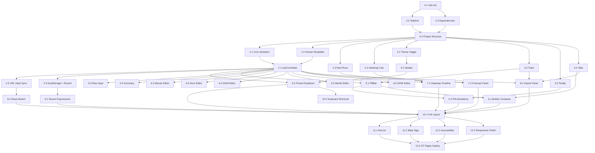

# CronBuild.com — Implementation Plan

> Derived from [CronBuild_BRD_v1.0.md](./CronBuild_BRD_v1.0.md)
>
> **Stack:** React 19+ (Vite), TypeScript, Tailwind CSS, Lucide Icons
> **Libraries:** `cronstrue`, `cron-parser`
> **Hosting:** Cloudflare Pages (static SPA, zero backend)

---

## Phase 0 — Project Scaffolding

### Task 0.1: Initialize Vite + React + TypeScript project

**Scope:**

- Run `npm create vite@latest` with the `react-ts` template at the repo root.
- Configure `tsconfig.json` with `strict: true`, path aliases (`@/` → `src/`).
- Add `vite.config.ts` with the `@` alias resolution.
- Verify `npm run dev` starts successfully.

**Files to create/modify:** `package.json`, `tsconfig.json`, `tsconfig.app.json`, `vite.config.ts`, `src/main.tsx`, `src/App.tsx`, `index.html`

**Acceptance criteria:** `npm run dev` serves a blank page at `localhost:5173` with no errors.

---

### Task 0.2: Install and configure Tailwind CSS v4

**Scope:**

- Install `tailwindcss @tailwindcss/vite`.
- Add the Tailwind Vite plugin to `vite.config.ts`.
- Replace default CSS with a root `src/index.css` containing `@import "tailwindcss"`.
- Define dark-mode strategy (`class` based via a `dark` class on `<html>`).
- Define custom theme tokens (accent color, surface colors, spacing scale) under `@theme` in `src/index.css`.

**Files to create/modify:** `src/index.css`, `vite.config.ts`, `package.json`

**Acceptance criteria:** Tailwind utility classes render correctly; dark mode toggles via class.

---

### Task 0.3: Install runtime dependencies

**Scope:**

- Install `cronstrue` (human-readable cron descriptions).
- Install `cron-parser` (next-run computation and validation).
- Install `lucide-react` (icons).

**Files to create/modify:** `package.json`

**Acceptance criteria:** All three packages import without errors in a test component.

---

### Task 0.4: Set up project structure and foundational utilities

**Scope:**

Create the directory layout and placeholder files:

```
src/
├── components/
│   ├── Header/
│   ├── PillBar/
│   ├── BuilderPanel/
│   ├── Timeline/
│   ├── Forecast/
│   ├── ExportPanel/
│   ├── RecentExpressions/
│   └── ui/              ← shared UI primitives (Toast, Tooltip, Tabs, Dropdown)
├── hooks/
│   ├── useCronState.ts
│   ├── useTheme.ts
│   └── useLocalStorage.ts
├── lib/
│   ├── cron-utils.ts     ← parse / validate / serialize helpers
│   ├── hash-utils.ts     ← URL hash encode/decode
│   └── constants.ts      ← presets, field metadata
├── types/
│   └── cron.ts           ← CronField, CronExpression, Preset, etc.
└── App.tsx
```

Define core TypeScript types in `src/types/cron.ts`:

```ts
type FieldName = 'minute' | 'hour' | 'dayOfMonth' | 'month' | 'dayOfWeek';

type FieldMode = 'every' | 'interval' | 'specific';

interface FieldState {
  mode: FieldMode;
  intervalStep?: number;    // N in */N or X/N
  intervalFrom?: number;    // X in X/N
  specificValues?: number[];
}

type CronState = Record<FieldName, FieldState>;
```

**Files to create:** All directories and files listed above (stub exports).

**Acceptance criteria:** `npm run build` succeeds with zero TypeScript errors on the stub project.

---

## Phase 1 — Cron Syntax Engine (Core Logic)

### Task 1.1: Implement cron field serializer / deserializer

**Scope:**

In `src/lib/cron-utils.ts`:

- `fieldStateToToken(field: FieldName, state: FieldState): string` — converts a `FieldState` to its cron token (`*`, `*/15`, `1,3,5`, `1-5`, etc.). Must handle `every`, `interval`, and `specific` modes. For `specific` mode, collapse consecutive values into ranges (e.g., `[1,2,3,5]` → `1-3,5`).
- `tokenToFieldState(field: FieldName, token: string): FieldState` — parses a single cron token string back into a `FieldState`.
- `cronStateToExpression(state: CronState): string` — joins all 5 fields with spaces.
- `expressionToCronState(expr: string): CronState` — splits on whitespace and parses each field.
- `validateField(field: FieldName, token: string): { valid: boolean; error?: string }` — validates a single field against its legal range (minute 0–59, hour 0–23, DOM 1–31, month 1–12, DOW 0–6). Returns field-specific error messages (e.g., `"Minute must be 0–59"`).
- `validateExpression(expr: string): { valid: boolean; errors: Record<FieldName, string | null> }` — validates all 5 fields.

**Files to create/modify:** `src/lib/cron-utils.ts`, `src/types/cron.ts`

**Acceptance criteria:**
- Round-trip: `cronStateToExpression(expressionToCronState(expr))` preserves semantics for all preset expressions.
- `validateField('minute', '80')` returns `{ valid: false, error: "Minute must be 0–59" }`.
- Specific values `[1,2,3,5]` serialize to `1-3,5`.

---

### Task 1.2: Implement human-readable summary via `cronstrue`

**Scope:**

In `src/lib/cron-utils.ts`:

- `getHumanReadable(expr: string): string` — wraps `cronstrue.toString(expr)` with error handling. Returns the human-readable string or a fallback error message for invalid expressions.

**Files to create/modify:** `src/lib/cron-utils.ts`

**Acceptance criteria:** `getHumanReadable('*/15 09-17 * * 1-5')` returns `"Every 15 minutes, between 09:00 AM and 05:59 PM, Monday through Friday"`.

---

### Task 1.3: Implement next-runs forecast via `cron-parser`

**Scope:**

In `src/lib/cron-utils.ts`:

- `getNextRuns(expr: string, count: number, tz: string): { timestamp: Date; relative: string }[]` — uses `cron-parser` to compute the next `count` execution times in the given timezone. Computes a static relative label (e.g., `"in 42 min"`) at call time (not live-ticking). Returns an empty array for invalid expressions.
- `getLocalTimezone(): string` — returns `Intl.DateTimeFormat().resolvedOptions().timeZone`.

**Files to create/modify:** `src/lib/cron-utils.ts`

**Acceptance criteria:** Returns exactly 5 results for a valid expression; returns `[]` for an invalid one; relative labels are human-readable.

---

### Task 1.4: Implement heatmap computation

**Scope:**

In `src/lib/cron-utils.ts`:

- `computeHeatmap(expr: string): boolean[][]` — returns a 7×24 matrix (rows = Monday–Sunday, cols = hours 00–23). Each cell is `true` if the cron expression fires at least once during that day/hour combination. Uses `cron-parser` to iterate over a representative week. Returns an all-false matrix for invalid expressions.

**Files to create/modify:** `src/lib/cron-utils.ts`

**Acceptance criteria:** For `* 9 * * 1` (every minute at 9 AM on Mondays), only `heatmap[0][9]` is `true` (Monday index 0, hour 9). All other cells are `false`.

---

## Phase 2 — State Management & URL Sync

### Task 2.1: Implement `useCronState` hook (central state)

**Scope:**

In `src/hooks/useCronState.ts`:

- Single source of truth: `CronState` (5 field states) + derived `expression: string` + derived `humanReadable: string` + derived `isValid: boolean` + derived `errors: Record<FieldName, string | null>`.
- Expose updaters: `setField(field: FieldName, state: FieldState)`, `setExpression(expr: string)` (parses and syncs all fields), `loadPreset(preset: Preset)`.
- All derived values recompute synchronously on every state change (within one render cycle per BRD §6.1).
- On mount, initialize from URL hash if present, otherwise use the default expression `* * * * *`.

**Dependencies:** Task 1.1, Task 1.2

**Files to create/modify:** `src/hooks/useCronState.ts`

**Acceptance criteria:** Changing a field via `setField` immediately updates `expression`, `humanReadable`, `isValid`, and `errors`. Calling `setExpression('*/15 09-17 * * 1-5')` updates all 5 field states.

---

### Task 2.2: Implement URL hash sync

**Scope:**

In `src/lib/hash-utils.ts`:

- `encodeHash(expr: string): string` — encodes expression to URL hash format: `#<minute>_<hour>_<dom>_<month>_<dow>` (fields separated by `_`).
- `decodeHash(hash: string): string | null` — decodes hash back to a space-separated cron expression. Returns `null` for invalid hashes.

In `useCronState`:

- On every valid expression change, push `encodeHash(expression)` to `window.location.hash` without triggering a page reload.
- On `hashchange` event, decode and call `setExpression`.
- On initial mount, read and apply `window.location.hash`.

**Dependencies:** Task 2.1

**Files to create/modify:** `src/lib/hash-utils.ts`, `src/hooks/useCronState.ts`

**Acceptance criteria:** Navigating to `cronbuild.com/#0_2_*_*_1-5` in an incognito window restores all 5 fields (BRD §6.4). Editing the GUI updates the URL hash in real time.

---

### Task 2.3: Implement `useLocalStorage` hook and recent expressions

**Scope:**

In `src/hooks/useLocalStorage.ts`:

- Generic `useLocalStorage<T>(key: string, defaultValue: T): [T, (val: T) => void]` hook.

In `useCronState` or a new `useRecentExpressions` hook:

- Maintain a list of the last 10 valid expressions in `localStorage` under key `cronbuild:recent`.
- Auto-save on expression change (debounced, deduplicated — no consecutive duplicates).
- Expose `recentExpressions: string[]` and `clearRecent(): void`.

**Dependencies:** Task 2.1

**Files to create/modify:** `src/hooks/useLocalStorage.ts`, `src/hooks/useCronState.ts` (or `src/hooks/useRecentExpressions.ts`)

**Acceptance criteria:** Refreshing the page preserves the last 10 expressions as clickable chips. Clicking a recent expression restores it.

---

## Phase 3 — Shared UI Primitives

### Task 3.1: Implement theme toggle (dark/light mode)

**Scope:**

In `src/hooks/useTheme.ts`:

- `useTheme()` hook that reads saved preference from `localStorage` (key `cronbuild:theme`), falls back to `prefers-color-scheme` media query, and toggles the `dark` class on `<html>`.
- Expose `theme: 'dark' | 'light'` and `toggleTheme()`.

**Files to create/modify:** `src/hooks/useTheme.ts`

**Acceptance criteria:** Default is dark mode. Toggle switches immediately. Preference persists across reloads.

---

### Task 3.2: Implement Toast component

**Scope:**

In `src/components/ui/Toast.tsx`:

- A lightweight toast notification component.
- Auto-dismiss after 2 seconds (per BRD §3.4).
- Renders at a fixed position (bottom-center or bottom-right).
- Expose a `useToast()` hook or context: `showToast(message: string)`.

**Files to create/modify:** `src/components/ui/Toast.tsx`, `src/components/ui/ToastProvider.tsx` (or combined)

**Acceptance criteria:** Calling `showToast("Copied!")` renders a toast that disappears after 2s. Multiple toasts stack without overlapping.

---

### Task 3.3: Implement Tooltip component

**Scope:**

In `src/components/ui/Tooltip.tsx`:

- Lightweight tooltip that appears on hover/focus.
- Accepts `content: string` and `children: ReactNode`.
- Used for validation error messages on pills (BRD §3.5).

**Files to create/modify:** `src/components/ui/Tooltip.tsx`

**Acceptance criteria:** Tooltip renders above/below the target element. Tooltip is accessible (role, aria attributes).

---

### Task 3.4: Implement Tabs component

**Scope:**

In `src/components/ui/Tabs.tsx`:

- Reusable tabbed interface component.
- Props: `tabs: { id: string; label: string; content: ReactNode }[]`, `activeTab: string`, `onTabChange: (id: string) => void`.
- Keyboard navigable (arrow keys switch tabs).

**Files to create/modify:** `src/components/ui/Tabs.tsx`

**Acceptance criteria:** Renders tabs with correct active state. Keyboard arrow keys navigate between tabs.

---

## Phase 4 — Header & Preset Dropdown

### Task 4.1: Implement Header component

**Scope:**

In `src/components/Header/Header.tsx`:

- Logo (text or simple SVG) + "CronBuild" title on the left.
- Preset dropdown trigger button (center-right).
- Theme toggle (sun/moon icon from Lucide) on the far right.
- Responsive: on mobile, elements stack or collapse gracefully.

**Dependencies:** Task 3.1

**Files to create/modify:** `src/components/Header/Header.tsx`, `src/components/Header/index.ts`

**Acceptance criteria:** Header renders with logo, preset button, and theme toggle. Theme toggle calls `toggleTheme()`.

---

### Task 4.2: Implement Preset Dropdown with search

**Scope:**

In `src/components/Header/PresetDropdown.tsx`:

- Define presets in `src/lib/constants.ts` as an array of `{ label: string; category: 'Common' | 'Business'; expression: string }`.
- Presets (from BRD §4.3):
  - **Common:** Every minute (`* * * * *`), Every 5 minutes (`*/5 * * * *`), Every 15 minutes (`*/15 * * * *`), Hourly (`0 * * * *`), Daily at midnight (`0 0 * * *`), Weekly on Sunday at 3 AM (`0 3 * * 0`).
  - **Business:** Weekdays at 9 AM (`0 9 * * 1-5`), Twice daily noon & midnight (`0 0,12 * * *`), First of every month (`0 0 1 * *`), Quarterly Jan/Apr/Jul/Oct 1st (`0 0 1 1,4,7,10 *`).
- Dropdown is triggered by button click **or** `Cmd+K` / `Ctrl+K` keyboard shortcut.
- Includes a search/filter input at the top; filters by label text.
- Grouped by category with section headers.
- Selecting a preset calls `loadPreset()` on the cron state.

**Dependencies:** Task 2.1

**Files to create/modify:** `src/components/Header/PresetDropdown.tsx`, `src/lib/constants.ts`

**Acceptance criteria:** `Cmd+K` opens the dropdown. Typing "weekly" filters to matching presets. Selecting a preset updates all fields, timeline, and URL hash (BRD §6.3).

---

## Phase 5 — Tokenized Cron Pill Bar

### Task 5.1: Implement PillBar component

**Scope:**

In `src/components/PillBar/PillBar.tsx`:

- Render 5 clickable pill buttons in a horizontal row, one per cron field.
- Each pill displays: field label (top, small) + current token value (bottom, mono font).
- Clicking a pill sets the active tab in the Builder Panel to that field.
- A clipboard copy button (`📋` icon from Lucide) at the end copies the full expression.

**Dependencies:** Task 2.1, Task 3.2

**Files to create/modify:** `src/components/PillBar/PillBar.tsx`, `src/components/PillBar/Pill.tsx`, `src/components/PillBar/index.ts`

**Acceptance criteria:** 5 pills render with correct labels and values. Clicking a pill activates the corresponding builder tab. Copy button triggers clipboard write + toast.

---

### Task 5.2: Implement pill animations and validation styling

**Scope:**

Enhance `Pill.tsx`:

- **Animated transitions (BRD §3.2):** When the token value changes, the old value fades out and the new value slides in. Use CSS `transition` / `@keyframes` only — no animation libraries.
- **Change diff flash (BRD §3.3):** On value change, the pill briefly pulses with an accent-colored glow (e.g., `box-shadow` animation over ~400ms).
- **Validation state (BRD §3.5):** If the field has a validation error, the pill border turns amber/red. Wrap the pill in a `<Tooltip>` showing the error message.

**Dependencies:** Task 5.1, Task 1.1 (validation), Task 3.3

**Files to create/modify:** `src/components/PillBar/Pill.tsx`, `src/index.css` (keyframes)

**Acceptance criteria:** Changing a pill value shows a smooth fade/slide transition and a brief glow. Invalid field `80` in minute pill turns pill red with tooltip `"Minute must be 0–59"`.

---

### Task 5.3: Implement raw input field

**Scope:**

In `src/components/PillBar/RawInput.tsx`:

- A text input below the pill bar showing the full raw cron expression.
- Editing the raw input calls `setExpression()` to sync all GUI controls bidirectionally (BRD §3.6).
- Must not cause cursor jumps during editing — use controlled input with careful cursor position preservation.
- A clipboard copy button next to the input.

**Dependencies:** Task 2.1, Task 3.2

**Files to create/modify:** `src/components/PillBar/RawInput.tsx`

**Acceptance criteria:** Typing `*/5 * * * *` in the raw input updates all pills, summary, timeline, and URL hash. No cursor jumps during typing. Copy button works with toast.

---

### Task 5.4: Implement human-readable summary display

**Scope:**

In `src/components/PillBar/Summary.tsx`:

- Display the `humanReadable` string from `useCronState` below the raw input.
- Style as a secondary text line.
- Shows nothing or a placeholder when the expression is invalid.

**Dependencies:** Task 1.2, Task 2.1

**Files to create/modify:** `src/components/PillBar/Summary.tsx`

**Acceptance criteria:** Summary updates instantly on any expression change. Shows correct human-readable text for all presets.

---

## Phase 6 — Builder Panel (Visual Field Editors)

### Task 6.1: Implement Builder Panel container with tabs

**Scope:**

In `src/components/BuilderPanel/BuilderPanel.tsx`:

- Use the `Tabs` component (Task 3.4) with 5 tabs: Minute, Hour, Day of Month, Month, Day of Week.
- Active tab is driven by pill click (Task 5.1) or direct tab click.
- Each tab renders the corresponding field editor component.

**Dependencies:** Task 3.4, Task 5.1

**Files to create/modify:** `src/components/BuilderPanel/BuilderPanel.tsx`, `src/components/BuilderPanel/index.ts`

**Acceptance criteria:** Clicking pill or tab switches the active editor. Active tab is visually highlighted.

---

### Task 6.2: Implement Minute field editor

**Scope:**

In `src/components/BuilderPanel/MinuteEditor.tsx`:

Three modes (radio selection):

1. **Every minute (`*`)** — single radio option.
2. **Interval (`*/N` or `X/N`)** — two number inputs: "Every [N] minutes starting at minute [X]".
3. **Specific minutes** — a 10×6 multi-select grid (values 0–59). Clicking a cell toggles it.

Changing any control calls `setField('minute', newState)`.

**Dependencies:** Task 2.1

**Files to create/modify:** `src/components/BuilderPanel/MinuteEditor.tsx`

**Acceptance criteria:** Selecting "Every 15 minutes" produces token `*/15`. Selecting specific minutes 0, 15, 30, 45 produces `0,15,30,45`. Grid cells visually toggle.

---

### Task 6.3: Implement Hour field editor

**Scope:**

In `src/components/BuilderPanel/HourEditor.tsx`:

Three modes:

1. **Every hour (`*`)**.
2. **Interval (`*/N` or `X/N`)** — "Every [N] hours starting at hour [X]".
3. **Specific hours** — 24-cell picker with AM/PM labels (12 AM, 1 AM, …, 11 PM). Multi-select.

**Dependencies:** Task 2.1

**Files to create/modify:** `src/components/BuilderPanel/HourEditor.tsx`

**Acceptance criteria:** Selecting hours 9–17 produces `9-17`. AM/PM labels display correctly.

---

### Task 6.4: Implement Day of Month field editor

**Scope:**

In `src/components/BuilderPanel/DayOfMonthEditor.tsx`:

Three modes:

1. **Every day (`*`)**.
2. **Interval (`X/N`)** — "Every [N] days starting on day [X]".
3. **Specific days** — 31-cell calendar-style grid (values 1–31). Multi-select.

**Dependencies:** Task 2.1

**Files to create/modify:** `src/components/BuilderPanel/DayOfMonthEditor.tsx`

**Acceptance criteria:** Selecting day 1 produces `1`. Selecting days 1 and 15 produces `1,15`.

---

### Task 6.5: Implement Month field editor

**Scope:**

In `src/components/BuilderPanel/MonthEditor.tsx`:

Two modes (no interval mode per BRD §4.2):

1. **Every month (`*`)**.
2. **Specific months** — 12 toggle pills labeled Jan–Dec. Multi-select.

**Dependencies:** Task 2.1

**Files to create/modify:** `src/components/BuilderPanel/MonthEditor.tsx`

**Acceptance criteria:** Selecting Jan, Apr, Jul, Oct produces `1,4,7,10`.

---

### Task 6.6: Implement Day of Week field editor

**Scope:**

In `src/components/BuilderPanel/DayOfWeekEditor.tsx`:

Three modes:

1. **Every day (`*`)**.
2. **Interval** — "Every [N] days starting [day name]".
3. **Specific days** — 7 checkboxes (Sun–Sat) + quick-select buttons: `[Weekdays]` (Mon–Fri), `[Weekends]` (Sat–Sun), `[Clear]`.

**Dependencies:** Task 2.1

**Files to create/modify:** `src/components/BuilderPanel/DayOfWeekEditor.tsx`

**Acceptance criteria:** Clicking `[Weekdays]` produces `1-5`. Clicking `[Weekends]` produces `0,6`. Toggling individual days works.

---

## Phase 7 — Visual Timeline & Forecast

### Task 7.1: Implement 24h × 7d heatmap timeline

**Scope:**

In `src/components/Timeline/Timeline.tsx`:

- Render a 7-row × 24-column `<div>` grid.
- Rows labeled Mon–Sun (left side). Columns labeled 00–23 (top).
- Each cell's active/inactive state is driven by `computeHeatmap()` (Task 1.4).
- Active cells use the accent color; inactive cells are dimmed/low-opacity.
- **No charting libraries** — pure HTML/CSS grid (BRD §4.4).
- Recalculates on every expression change.

**Dependencies:** Task 1.4, Task 2.1

**Files to create/modify:** `src/components/Timeline/Timeline.tsx`, `src/components/Timeline/index.ts`

**Acceptance criteria:** For `0 9 * * 1` (9 AM on Mondays), only the Monday/09 cell is highlighted (BRD §6.6). Grid is responsive.

---

### Task 7.2: Implement Execution Forecast panel

**Scope:**

In `src/components/Forecast/Forecast.tsx`:

- Display the next 5 execution timestamps using `getNextRuns()` (Task 1.3).
- Each row shows: formatted date/time + relative label (e.g., `"in 42 min"`).
- Timezone toggle: `(●) Local [detected TZ]` / `(○) UTC`. Switching recomputes the forecast.
- Static relative labels — computed once per expression change, not live-ticking (BRD §4.5).

**Dependencies:** Task 1.3, Task 2.1

**Files to create/modify:** `src/components/Forecast/Forecast.tsx`, `src/components/Forecast/index.ts`

**Acceptance criteria:** Shows 5 timestamps. Switching to UTC recalculates. Invalid expression shows empty or error state.

---

## Phase 8 — Developer & AI Export Snippets

### Task 8.1: Implement Export Panel with tabbed code blocks

**Scope:**

In `src/components/ExportPanel/ExportPanel.tsx`:

- Use `Tabs` component with 4 tabs: **crontab**, **GitHub Actions**, **Kubernetes CronJob**, **AI Prompt**.
- Each tab renders a syntax-highlighted code block using a `<pre><code>` element.
- No syntax highlighting library — use Tailwind text colors for minimal keyword highlighting, or render plain monospaced text.
- Each tab has a **Copy Snippet** button that copies the content and shows a toast.

Template strings for each tab (interpolate the active expression + human summary + timezone + next run):

1. **Linux crontab:** `<expression> /path/to/script.sh`
2. **GitHub Actions:** YAML `on.schedule` block.
3. **Kubernetes CronJob:** YAML `CronJob` manifest.
4. **AI Prompt:** Structured text block with expression, description, timezone, next run, and requirements (BRD §4.6).

**Dependencies:** Task 2.1, Task 1.2, Task 1.3, Task 3.4, Task 3.2

**Files to create/modify:** `src/components/ExportPanel/ExportPanel.tsx`, `src/components/ExportPanel/snippets.ts`, `src/components/ExportPanel/index.ts`

**Acceptance criteria:** All 4 tabs accurately reflect the active expression (BRD §6.5). Copy buttons trigger clipboard + toast.

---

### Task 8.2: Implement Share URL button

**Scope:**

In `src/components/ExportPanel/ShareButton.tsx` (or inline in `ExportPanel`):

- "Share URL" button that copies the full URL (origin + hash) to the clipboard.
- Shows a toast: `"Link copied!"`.

**Dependencies:** Task 2.2, Task 3.2

**Files to create/modify:** `src/components/ExportPanel/ShareButton.tsx`

**Acceptance criteria:** Copied URL is `https://cronbuild.com/#*/15_09-17_*_*_1-5` (or `localhost` equivalent). Pasting in a new tab restores state.

---

## Phase 9 — Recent Expressions Bar

### Task 9.1: Implement Recent Expressions component

**Scope:**

In `src/components/RecentExpressions/RecentExpressions.tsx`:

- Render clickable chips for each expression in `recentExpressions` (from Task 2.3).
- Clicking a chip calls `setExpression()` to restore it.
- Displayed at the bottom of the page (per BRD layout).
- Label: `RECENT:` prefix.

**Dependencies:** Task 2.3, Task 2.1

**Files to create/modify:** `src/components/RecentExpressions/RecentExpressions.tsx`, `src/components/RecentExpressions/index.ts`

**Acceptance criteria:** Shows up to 10 recent expressions. Clicking one restores the full state. List persists across reloads.

---

## Phase 10 — Page Composition & Layout

### Task 10.1: Compose the full-page layout in App.tsx

**Scope:**

In `src/App.tsx`:

- Wire all components together in a single-screen layout matching the BRD wireframe (§2).
- Layout structure (top to bottom):
  1. `<Header>` (logo, presets, theme toggle)
  2. `<PillBar>` (pills + raw input + summary)
  3. `<BuilderPanel>` (tabbed field editors)
  4. Side-by-side: `<Timeline>` (left) + `<ExportPanel>` (right) — stack vertically on mobile.
  5. `<Forecast>` (below or beside timeline)
  6. `<RecentExpressions>` (bottom bar)
- Wrap everything in a `<ToastProvider>`.
- Pass `useCronState` as props or context to all children.
- Responsive: Tailwind breakpoints for mobile/tablet/desktop. Everything stacks on small screens.

**Dependencies:** All Phase 3–9 tasks

**Files to create/modify:** `src/App.tsx`, `src/main.tsx`

**Acceptance criteria:** All components render in the correct layout. Full bi-directional sync works end-to-end (BRD §6.1). Responsive layout works on mobile (≥375px) and desktop.

---

### Task 10.2: Implement keyboard shortcuts

**Scope:**

In `src/hooks/useKeyboardShortcuts.ts` (or inline in `App.tsx`):

- `Cmd+K` / `Ctrl+K` — open/close preset dropdown.
- Ensure no conflicts with browser defaults.

**Dependencies:** Task 4.2

**Files to create/modify:** `src/hooks/useKeyboardShortcuts.ts`

**Acceptance criteria:** `Cmd+K` opens the preset dropdown from anywhere on the page.

---

## Phase 11 — Static Assets & AI Ecosystem

### Task 11.1: Create `llms.txt` for AI agent deep-linking

**Scope:**

In `public/llms.txt`:

- Create a static text file per the `llms.txt` specification (BRD §4.8).
- Document CronBuild's purpose, URL schema (`https://cronbuild.com/#<minute>_<hour>_<dom>_<month>_<dow>`), field formats, and usage examples.
- Include example deep-links for common schedules.

**Files to create:** `public/llms.txt`

**Acceptance criteria:** `GET /llms.txt` returns valid content. Describes the URL schema accurately (BRD §6.7).

---

### Task 11.2: Configure `index.html` meta tags and favicon

**Scope:**

In `index.html`:

- Set `<title>CronBuild — Visual Cron Expression Builder</title>`.
- Add `<meta name="description">` for SEO.
- Add Open Graph tags (`og:title`, `og:description`, `og:url`, `og:image`).
- Add a simple favicon (can use an emoji favicon or a minimal SVG).
- Set viewport meta for mobile responsiveness.

**Files to create/modify:** `index.html`, `public/favicon.svg` (or `.ico`)

**Acceptance criteria:** Page has correct title, meta description, and favicon in browser tab.

---

## Phase 12 — Polish, Accessibility & Deployment

### Task 12.1: Accessibility pass

**Scope:**

Across all components:

- Ensure semantic HTML: `<header>`, `<main>`, `<section>`, `<nav>`, `<button>`, `<label>`.
- All interactive elements are keyboard-focusable and operable via Enter/Space.
- Add `aria-label`, `aria-describedby`, `role` attributes where needed (tabs, tooltips, toasts).
- Tab order follows visual layout.
- Color contrast meets minimum readability standards in both dark and light modes.

**Files to modify:** All component files.

**Acceptance criteria:** Full keyboard navigation works (Tab through pills → builder → timeline → exports → recents). Screen reader announces pill labels and values.

---

### Task 12.2: Responsive design refinements

**Scope:**

- Test and fix layout at breakpoints: 375px (mobile), 768px (tablet), 1024px+ (desktop).
- Timeline + Export panel stack vertically below `md` breakpoint.
- Pill bar wraps on narrow screens.
- Builder panel grid adapts (e.g., minute grid becomes scrollable or wraps).
- Preset dropdown is full-width modal on mobile.

**Files to modify:** Component files, `src/index.css`

**Acceptance criteria:** No horizontal overflow on any screen width ≥ 375px. All features remain usable on mobile.

---

### Task 12.3: Configure Cloudflare Pages deployment

**Scope:**

- Add a `wrangler.toml` or Cloudflare Pages config if needed, or rely on default Vite build output.
- Ensure `npm run build` produces a `dist/` directory with `index.html` and all static assets.
- Add SPA redirect rule: all routes → `index.html` (for hash-based routing this is implicit, but confirm).
- Add `public/_headers` file to set appropriate cache headers and security headers (`X-Content-Type-Options`, `X-Frame-Options`, etc.).
- Add `public/_redirects` if needed.

**Files to create/modify:** `public/_headers`, `public/_redirects` (if needed)

**Acceptance criteria:** `npm run build` succeeds. `dist/` contains `index.html`, `llms.txt`, all JS/CSS assets. Deploying to Cloudflare Pages works.

---

## Task Dependency Graph



---

## Summary

| Phase | Tasks | Description |
|:------|:------|:------------|
| **0** | 0.1 – 0.4 | Project scaffolding, tooling, structure |
| **1** | 1.1 – 1.4 | Core cron engine (serialize, validate, forecast, heatmap) |
| **2** | 2.1 – 2.3 | State management, URL hash sync, localStorage |
| **3** | 3.1 – 3.4 | Shared UI primitives (theme, toast, tooltip, tabs) |
| **4** | 4.1 – 4.2 | Header & preset dropdown |
| **5** | 5.1 – 5.4 | Tokenized pill bar, raw input, summary |
| **6** | 6.1 – 6.6 | Builder panel (5 field editors) |
| **7** | 7.1 – 7.2 | Visual timeline heatmap & execution forecast |
| **8** | 8.1 – 8.2 | Developer/AI export snippets & share URL |
| **9** | 9.1 | Recent expressions bar |
| **10** | 10.1 – 10.2 | Full page composition & keyboard shortcuts |
| **11** | 11.1 – 11.2 | Static assets (llms.txt, meta tags) |
| **12** | 12.1 – 12.3 | Accessibility, responsive polish, deployment |

**Total: 35 tasks across 13 phases**
